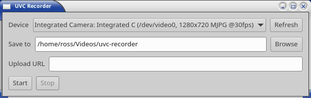

# UVC Recorder

Linux app that finds a UVC camera and writes a continuous sequence of
3-second MP4 files. Each file has camera video plus a silent AAC track.
Chunks do not skip or overlap.

Stack: C++20, GTK 4, GStreamer 1.0, CMake, libcurl. Linux only.



## Prebuilt executable (Linux x86_64)

GTK 4, GStreamer and libcurl are already inside `bin/`. No extra packages.

```bash
./bin/uvc-recorder
```

## Prerequisites

Needed only if you build from source: C++20 compiler, CMake ≥ 3.20, GTK 4,
GStreamer 1.0, libcurl. Access to `/dev/video*` (usually
`sudo usermod -aG video $USER`, then re-login).

Runtime GStreamer elements: `v4l2src`, `jpegdec`, `videoconvert`,
`openh264enc`, `h264parse`, `splitmuxsink`, `audiotestsrc`,
`fdkaacenc` (or `avenc_aac`), `aacparse`.

Debian / Ubuntu / Mint:

```bash
sudo apt install g++ cmake pkg-config libgtk-4-dev \
  libgstreamer1.0-dev libgstreamer-plugins-base1.0-dev libcurl4-openssl-dev \
  gstreamer1.0-plugins-good gstreamer1.0-plugins-bad gstreamer1.0-libav
```

Fedora / RHEL / Rocky / Alma:

```bash
sudo dnf install gcc-c++ cmake pkgconf-pkg-config \
  gtk4-devel gstreamer1-devel gstreamer1-plugins-base-devel libcurl-devel \
  gstreamer1-plugins-good gstreamer1-plugins-bad-free \
  gstreamer1-plugin-openh264
```

Arch / Manjaro:

```bash
sudo pacman -S gcc cmake pkgconf gtk4 curl \
  gstreamer gst-plugins-base gst-plugins-good gst-plugins-bad gst-libav
```

If `openh264enc` is missing after install, add the distro’s OpenH264 GStreamer
plugin (on Fedora / RHEL-family: `gstreamer1-plugin-openh264`).

## Build and run

```bash
cmake -S . -B build -DCMAKE_BUILD_TYPE=Release
cmake --build build -j
./build/uvc-recorder
```

1. Select a UVC device.
2. Output folder (default `~/Videos/uvc-recorder`).
3. Optional REST URL to upload finished files in order.
4. **Start** — files go to `YYYY-MM-DD_HH-MM-SS/chunk_XXXXX.mp4`.
5. **Stop** — the last file is finalized so it stays a valid MP4.

## Approach

| Directory     | Responsibility                        |
|---------------|---------------------------------------|
| `src/device`  | Detect UVC cameras via V4L2           |
| `src/capture` | Record gapless 3-second MP4 chunks    |
| `src/upload`  | POST finished files to REST, in order |
| `src/ui`      | GTK 4 window                          |

`splitmuxsink` rotates files without restarting the encoder. GOP is 3 seconds;
keyframes are requested at each cut. Each chunk carries SPS/PPS so it plays
alone. Silence is `audiotestsrc wave=silence`.

